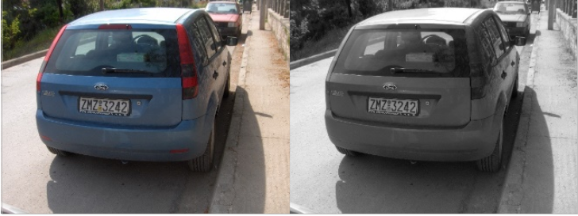
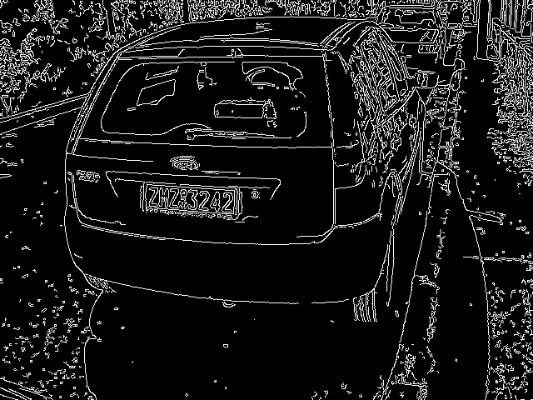
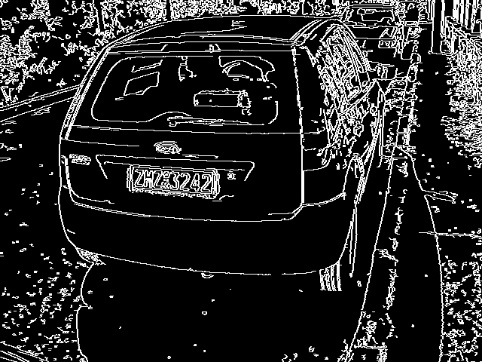
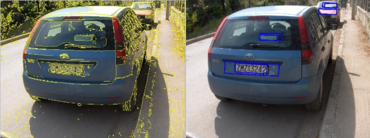
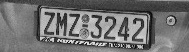
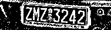
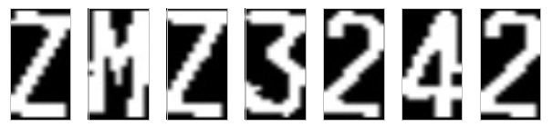
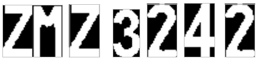
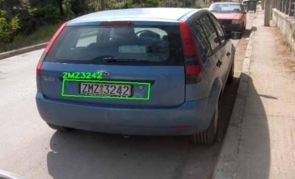

# License Plate Detection and Recognition System (Only with Image Processing)

This project is a License Plate Recognition System (LPRS) developed using **only image processing techniques**, without using any machine learning or deep learning models.

## 🎯 Project Goal

To detect vehicle license plates and recognize the characters on them using classical image processing techniques. The project does **not require training** and is suitable for low-resource systems.

---

## 🧩 Project Stages

The system consists of two main stages:

1. **License Plate Detection**
2. **Character Recognition**

---

## 🛠️ Techniques Used

### 🔍 License Plate Detection
Several image processing steps are used to locate candidate license plate regions:
- Grayscale conversion
- Canny Edge Detection
- Dilation and Skeletonization
- Contour Extraction
- Geometrical Filtering (based on aspect ratio and angle)
- CLAHE (Contrast Limited Adaptive Histogram Equalization)

Each contour is evaluated and the ones matching license plate size/ratio characteristics are kept as plate candidates.

### 🔤 Character Recognition
Once plate candidates are found:
- Region of interest (ROI) is cropped and resized
- CLAHE is applied
- Adaptive thresholding is performed
- **Connected Component Analysis** is used to find characters
- Each character is compared using **Template Matching** with predefined BMP images

This approach uses `cv2.matchTemplate()` to find the best matching character with a similarity threshold.

---

## ⌨️ Keyboard Controls

While the program is running:

| Key | Function                     |
|-----|------------------------------|
| `d` | Next image processing step   |
| `a` | Previous image processing step |
| `c` | Load next image              |
| `z` | Load previous image          |
| `s` | Save all processing steps as images |
| `q` | Quit the program             |

---

## 📂 Folder Structure

```
project-root/
│
├── plate/             # Template images (.bmp) for character recognition
├── cars/              # Input vehicle images
├── output/            # Saved steps (generated after pressing 's')
├── plate_recognation.py  # Contains template matching functions
└── main.py            # Main executable file with UI and logic
```

---

## 🖼️ Example Flow

🟩 Step 1: Convert image to grayscale and resize <br>
<br>
🟩 Step 2: Detect edges with Canny<br>
<br>
🟩 Step 3: Apply dilation and skeletonization<br>
<br>
🟩 Step 4: Extract contours and filter candidates<br>
<br>
🟩 Step 5: Crop ROI<br>
<br>
🟩 Step 6: Enhance ROI with CLAHE<br>
<br>
🟩 Step 7: Thresholding<br>
<br>
🟩 Step 8: Connected Component Analysis<br>
<br>
🟩 Step 9: Match detected characters with template images<br>
<br>
🟩 Step 10: Draw final license plate and recognized text on the original image<br>
<br>


---

## 🧪 Sample Result

The program overlays the detected license plate and recognized characters on the original image. All steps are visualized in real time and can be saved for inspection.

---

## 🔋 Requirements

- Python 3.x
- OpenCV (`cv2`)
- NumPy
- `scikit-image` (for `skeletonize`)

Install with:

```bash
pip install opencv-python-headless numpy scikit-image
```

---

## 🧠 Why No AI?

This project shows that **traditional image processing techniques** can still be effective in solving real-world problems like license plate recognition. It is lightweight, explainable, and does not require any training dataset.

